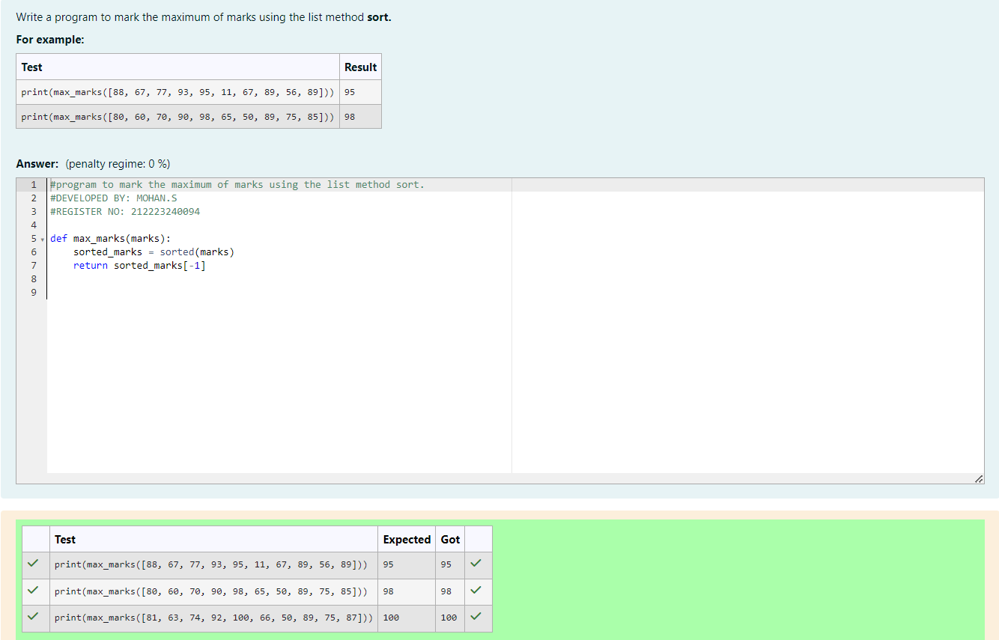
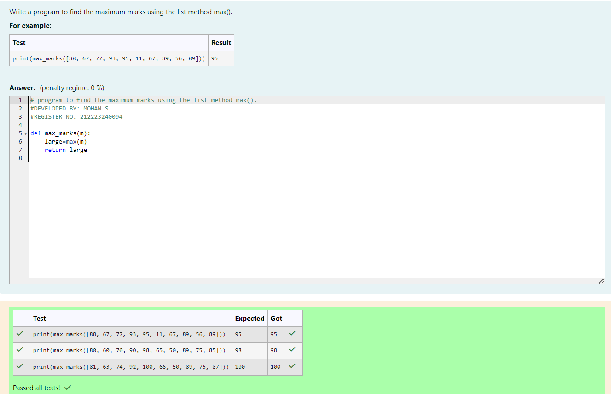
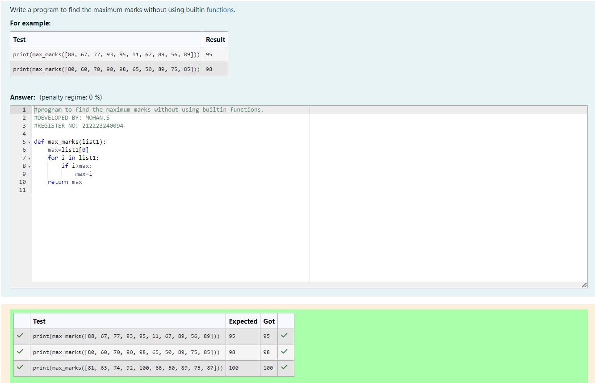

# DATE:
# EX.NO.06 Find the maximum of a list of numbers
## Aim:
To write a program to find the maximum of a list of numbers.
## Equipment’s required:
1.	Hardware – PCs
2.	Anaconda – Python 3.7 Installation / Moodle-Code Runner
## Algorithm:
1.	Get the list of marks as input
2.	Use the sort() function or max() function or use the for loop to find the maximum mark.
3.	Return the maximum value
## Program:

i)	# To find the maximum of marks using the list method sort.
```Python
DEVELOPED BY: MOHAN.S
REGISTER NO: 212223240094

def max_marks(marks):
    sorted_marks = sorted(marks)
    return sorted_marks[-1]

```

ii)	# To find the maximum marks using the list method max().
```Python
DEVELOPED BY: MOHAN.S
REGISTER NO: 212223240094

def max_marks(m):
    large=max(m)
    return large
    
```

iii) # To find the maximum marks without using builtin functions.
```Python
DEVELOPED BY: MOHAN.S
REGISTER NO: 212223240094

def max_marks(list1):
    max=list1[0]
    for i in list1:
        if i>max:
            max=i
    return max

```


## Output:
i)	# To find the maximum of marks using the list method sort.


ii)	# To find the maximum marks using the list method max().


iii) # To find the maximum marks without using builtin functions.


## Result:
Thus the program to find the maximum of given numbers from the list is written and verified using python programming.
